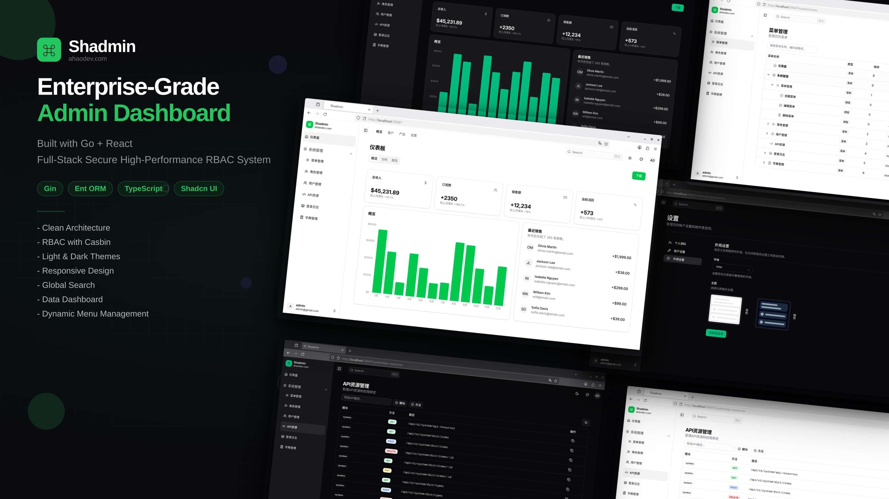

<div align="center">

# Shadmin

**An Enterprise-Grade Full-Stack RBAC Permission Management System Built with Go + React**

[简体中文](./README.zh.md) · English



[](https://go.dev/)
[](https://react.dev/)
[](https://www.typescriptlang.org/)
[](LICENSE)

`Gin` · `Ent ORM` · `Casbin` · `Shadcn UI` · `TanStack Router` · `Tailwind CSS`

</div>

---

## ✨ Features

- 🏗️ **Clean Architecture** — Domain‑driven layered design (Controller → Usecase → Repository)
- 🔐 **RBAC with Casbin** — Fine‑grained role‑based access control for APIs and menus
- 🌗 **Light & Dark Themes** — Seamless theme switching with system preference detection
- 📱 **Responsive Design** — Optimized for desktop, tablet, and mobile
- 🔍 **Global Search** — Quick navigation across menus and resources
- 📊 **Dashboard** — Data visualization with charts and statistics
- 🗂️ **Dynamic Menus** — Backend‑driven menu tree with permission‑aware rendering
- 🗄️ **Multi‑Database** — SQLite (default), PostgreSQL, MySQL out of the box

## 🚀 Get Running

### Prerequisites

- Go 1.25+
- Node.js 18+ & pnpm (or npm)

### Run

```bash
# Clone the repository
git clone https://github.com/ahaodev/shadmin.git
cd shadmin

# Install & build frontend
cd web && pnpm install && pnpm build

# Start backend (from project root)
# Generates Ent code, embeds web/dist/, listens on :55667
# .env auto‑generated on first run
cd ..
go generate ./ent
go run .
```

> **Default login:** `admin` / `123`

## 🔐 Auth & Permissions

- **Authentication**: JWT access + refresh tokens via `Authorization: Bearer <token>`
- **API Authorization**: Casbin middleware checks `(userID, path, method)` on protected routes
- **Frontend Guards**: Permission‑aware components (`PermissionButton`, `PermissionGuard`)
- **Menu System**: Dynamic menus from `/api/v1/resources`, auto‑adapted to user permissions

<details>
<summary>📁 <b>Project Structure</b></summary>

```
shadmin/
├── api/            # Controllers & routes (Gin)
├── bootstarp/      # App bootstrap, DB, Casbin, seed
├── domain/         # Entities, DTOs, interfaces
├── ent/schema/     # Ent ORM schemas
├── repository/     # Data access layer
├── usecase/        # Business logic
├── internal/       # Internal utilities
├── pkg/            # Shared packages
├── web/            # React frontend (Vite + shadcn/ui)
│   └── src/
│       ├── routes/       # TanStack file‑based routing
│       ├── features/     # Feature modules
│       ├── services/     # API wrappers (Axios)
│       └── stores/       # Zustand state management
├── docs/           # Documentation & images
└── main.go         # Entry point
```

</details>

## 📚 Documentation

- [Architecture (EN)](docs/getting-started/architecture.en.md) · [架构 (中文)](docs/getting-started/architecture.zh.md)
- [Quick Start (EN)](docs/getting-started/quickstart.en.md) · [快速开始 (中文)](docs/getting-started/quickstart.zh.md)
- [Development (EN)](docs/getting-started/development.en.md) · [开发指南 (中文)](docs/getting-started/development.zh.md)
- [Deployment (EN)](docs/getting-started/deployment.en.md) · [部署 (中文)](docs/getting-started/deployment.zh.md)

## 📄 License

[MIT](LICENSE)
